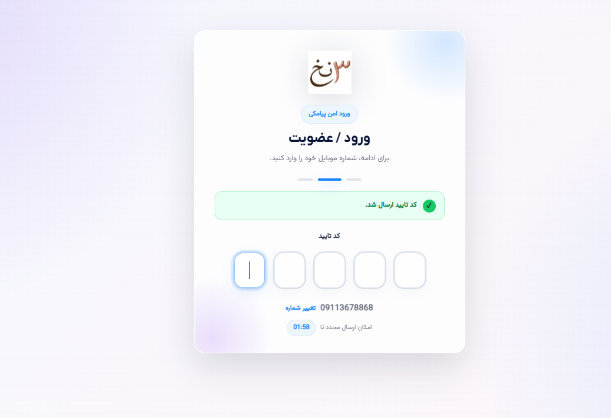

# Woocom SMS Auth

افزونه **Woocom SMS Auth** یک افزونه ورود و عضویت پیامکی برای وردپرس و ووکامرس است که با معماری OOP توسعه داده شده و امکان ورود/ثبت‌نام با OTP، اتصال به چندین سرویس‌دهنده پیامک ایرانی، تطبیق کد ملی و شماره همراه، جایگزینی فرم‌های ورود/عضویت و ساخت صفحه ورود اختصاصی را فراهم می‌کند.

این افزونه برای سایت‌های وردپرسی، فروشگاه‌های ووکامرسی و سایت‌هایی که نیاز به ورود سریع، امن و کاربرپسند با شماره موبایل دارند طراحی شده است.

---

## اطلاعات افزونه

| مورد | توضیحات |
|---|---|
| نام افزونه | Woocom SMS Auth |
| نسخه فعلی | 1.6.2 |
| حداقل نسخه وردپرس | 6.0 |
| حداقل نسخه PHP | 7.4 |
| سازگاری | WordPress / WooCommerce |
| معماری | OOP / Provider-based |
| توسعه‌دهنده | مهندس سعید قربانیان |
| برند | Woocom |
| وب‌سایت | [woocom.ir](https://woocom.ir/) |
| پشتیبانی | 09113678868 |
| لایسنس | GPLv2 or later |

---

## قابلیت‌های اصلی

- ورود و عضویت با شماره موبایل و کد یکبار مصرف OTP
- ثبت‌نام خودکار کاربر پس از تأیید شماره موبایل
- دریافت نام، نام خانوادگی و کد ملی در مرحله ثبت‌نام
- اعتبارسنجی ساختار کد ملی ایران
- تطبیق کد ملی و شماره همراه از طریق سرویس جیبیت
- پشتیبانی از چندین سرویس‌دهنده پیامک ایرانی
- تنظیم فرم اختصاصی ورود بدون هدر و فوتر قالب
- جایگزینی فرم ورود و عضویت ووکامرس
- جایگزینی فرم‌های ورود/عضویت قالب‌ها و افزونه‌های دیگر به‌صورت عمومی
- امکان هدایت کاربر مهمان از My Account ووکامرس به صفحه اختصاصی ورود افزونه
- امکان الزام ورود قبل از تسویه حساب ووکامرس
- امکان نمایش ورود/عضویت به‌صورت مودال در مسیر تسویه حساب
- رابط کاربری مدرن، RTL، واکنش‌گرا و قابل سفارشی‌سازی
- افکت Aurora برای فیلدهای OTP هنگام اعتبارسنجی
- شمارنده معکوس اعتبار OTP و ارسال مجدد کد با Ajax
- لاگ داخلی برای عیب‌یابی ارسال پیامک و سرویس‌ها
- قابلیت تست ارسال پیامک از داخل پنل مدیریت
- پشتیبانی از Media Library وردپرس برای انتخاب لوگو و تصویر پس‌زمینه
- سازگار با HPOS ووکامرس

---

## سرویس‌دهنده‌های پیامک پشتیبانی‌شده

افزونه با معماری Provider-based طراحی شده و در حال حاضر سرویس‌دهنده‌های زیر را پشتیبانی می‌کند:

| شناسه Provider | نام سرویس‌دهنده | سایت/دامنه | نوع احراز هویت | امکانات |
|---|---|---|---|---|
| `kavenegar` | کاوه‌نگار | kavenegar.com | API Key | ارسال ساده، Pattern / Verify Lookup |
| `sms_ir` | SMS.ir / اس‌ام‌اس دات آی‌آر | sms.ir | API Key | Pattern، ارسال متن، اعتبار |
| `meli_payamak` | ملی پیامک | melipayamak.com | Username / Password | Pattern، ارسال متن |
| `payamito` | پیامیتو | payamito.com / payamak-panel.com | Username / Password | ارسال OTP، ارسال بر اساس الگو، REST fallback |
| `payam_resan` | پیام‌رسان | payam-resan.com | Username / Password | Pattern، ارسال متن |
| `faraz_sms` | فراز اس‌ام‌اس / IPPanel | farazsms.com | API Key | Pattern، ارسال متن |
| `raygan_sms` | رایگان اس‌ام‌اس | raygansms.com | Username / Password / Token | OTP، Pattern، ارسال متن |
| `web_one` | وب‌وان | webone-sms.com | Username / Password | OTP، ارسال متن |
| `amoot_sms` | پیامک آموت | amootsms.com | API Key | Pattern، ارسال متن |
| `fara_payamak` | فراپیامک | farapayamak.ir | Username / Password | Pattern، ارسال متن |
| `ghasedak` | قاصدک | ghasedak.me | API Key | Pattern، ارسال متن |
| `behin_payam` | بهین پیام | behinpayam.com | Username / Password | Pattern، ارسال متن |
| `asanak` | آسانک | asanak.com | Username / Password | Pattern، ارسال متن |
| `mediana` | مدیانا | mediana.ir | API Key | Pattern، ارسال متن |
| `custom_rest` | سرویس‌دهنده سفارشی REST | - | Custom | اتصال به پنل‌های ناشناخته با URL و Body سفارشی |

### توضیح درباره سرویس‌دهنده سفارشی REST

اگر پنل پیامکی شما در لیست بالا وجود ندارد، می‌توانید از Provider سفارشی REST استفاده کنید. در این حالت امکان تعریف URL، متد درخواست، هدر احراز هویت، بدنه درخواست و مسیر تشخیص موفقیت وجود دارد.

متغیرهای قابل استفاده در بدنه یا URL سفارشی:

- `{mobile}` شماره موبایل با فرمت بین‌المللی
- `{mobile_09}` شماره موبایل با فرمت 09
- `{code}` کد OTP
- `{message}` متن پیامک
- `{sender}` شماره فرستنده
- `{site}` نام سایت

---

## سرویس تطبیق کد ملی و شماره موبایل

افزونه از سرویس جیبیت برای تطبیق کد ملی و شماره همراه پشتیبانی می‌کند.

قابلیت‌ها:

- دریافت API Key و Secret Key جیبیت از تنظیمات
- دریافت/مدیریت توکن به‌صورت داخلی
- بررسی تطبیق شماره موبایل و کد ملی هنگام ثبت‌نام
- امکان اجباری یا اختیاری کردن تطبیق در تنظیمات
- کش کردن نتیجه تطبیق برای کاهش درخواست‌های تکراری

---

## تجربه کاربری فرم ورود

فرم ورود افزونه شامل مراحل زیر است:

1. ورود شماره موبایل
2. ارسال کد OTP از سرویس‌دهنده پیامک انتخاب‌شده
3. نمایش فیلدهای جداگانه برای هر رقم OTP
4. اعتبارسنجی خودکار پس از تکمیل کد
5. نمایش افکت Aurora هنگام انتظار برای پاسخ Ajax
6. در صورت موفقیت، جمع شدن فیلدهای OTP و نمایش تیک سبز
7. در صورت خطا، تغییر حالت فیلدها به رنگ قرمز و نمایش پیام خطا
8. در صورت کاربر جدید بودن، نمایش فرم تکمیل ثبت‌نام


## Screenshots

| Login / Register                                                      | OTP Verification                                                          |
| --------------------------------------------------------------------- | ------------------------------------------------------------------------- |
|  |  |

| OTP Error State                                                                |
| ------------------------------------------------------------------------------ |
|  |


---

## امکانات ووکامرس

- جایگزینی فرم ورود و عضویت صفحه My Account
- هدایت کاربر مهمان از `/my-account/` به صفحه ورود اختصاصی افزونه
- عدم دخالت در داشبورد My Account برای کاربران لاگین‌شده
- حفظ endpointهای ووکامرس مانند سفارش‌ها، آدرس‌ها، ویرایش حساب و خروج
- الزام ورود قبل از ورود به Checkout
- امکان نمایش ورود/عضویت در مودال بدون خروج از مسیر Checkout
- سازگاری با فروش مهمان؛ این قابلیت فقط در صورت فعال‌کردن گزینه مربوطه رفتار Guest Checkout را تغییر می‌دهد
- سازگار با HPOS ووکامرس

---

## تنظیمات افزونه

پس از نصب افزونه، تنظیمات از مسیر زیر در دسترس است:

```text
پیشخوان وردپرس → ورود پیامکی
```

بخش‌های تنظیمات:

- عمومی
- پیامک
- تطبیق هویت
- امنیت و OTP
- رابط کاربری
- لاگ‌ها

### تنظیمات عمومی

- فعال/غیرفعال کردن افزونه
- تعیین حالت نمایش فرم
- هدایت wp-login.php به صفحه ورود افزونه
- جایگزینی فرم‌های ورود/عضویت قالب‌ها
- جایگزینی فرم ووکامرس
- هدایت مهمان از My Account به صفحه ورود افزونه
- تنظیم آدرس بعد از ورود و ثبت‌نام
- تنظیم رفتار checkout برای کاربران مهمان

### تنظیمات پیامک

- انتخاب سرویس‌دهنده فعال
- نمایش فیلدهای اختصاصی هر سرویس‌دهنده بر اساس نوع احراز هویت
- تنظیم API Key، Token، Username، Password، Sender، Pattern Code یا BodyId
- ارسال تست پیامک
- نمایش لاگ پاسخ وب‌سرویس برای عیب‌یابی

### تنظیمات امنیت و OTP

- طول کد OTP بین 4 تا 6 رقم
- زمان اعتبار OTP
- محدودیت ارسال برای هر شماره موبایل
- محدودیت ارسال بر اساس IP
- محدودیت تلاش برای تأیید OTP
- فعال/غیرفعال کردن حالت تست

### تنظیمات رابط کاربری

- انتخاب لوگو از Media Library وردپرس
- انتخاب تصویر پس‌زمینه از Media Library
- تغییر رنگ اصلی
- تغییر رنگ دکمه
- تغییر رنگ متن دکمه
- تغییر رنگ پس‌زمینه
- تغییر رنگ عنوان، متن، متن کم‌رنگ و فیلدها
- تنظیم عرض فرم
- تنظیم radius فرم و دکمه‌ها
- تنظیم عنوان و زیرعنوان فرم

---

## نصب

### نصب از طریق پنل وردپرس

1. فایل ZIP افزونه را دانلود کنید.
2. وارد پیشخوان وردپرس شوید.
3. از مسیر «افزونه‌ها → افزودن → بارگذاری افزونه» فایل ZIP را آپلود کنید.
4. افزونه را فعال کنید.
5. از منوی «ورود پیامکی» تنظیمات را انجام دهید.

### نصب دستی

1. پوشه افزونه را با نام `woocom-sms-auth` در مسیر زیر قرار دهید:

```text
wp-content/plugins/woocom-sms-auth
```

2. افزونه را از پیشخوان وردپرس فعال کنید.

---

## شورت‌کدها

برای نمایش فرم ورود/عضویت پیامکی در هر صفحه یا قالب می‌توانید از شورت‌کد زیر استفاده کنید:

```text
[smsauth_form]
```

---

## مسیر پیش‌فرض ورود

مسیر پیش‌فرض صفحه ورود اختصاصی افزونه:

```text
/sms-login/
```

این مسیر از تنظیمات افزونه قابل تغییر است.

---

## ساختار پروژه

ساختار کلی افزونه:

```text
woocom-sms-auth/
├── assets/
│   ├── css/
│   │   └── frontend.css
│   └── js/
│       └── frontend.js
├── includes/
│   ├── Admin/
│   ├── Auth/
│   ├── Frontend/
│   ├── Providers/
│   │   ├── Sms/
│   │   └── Identity/
│   └── Support/
├── templates/
│   └── woocommerce/
├── readme.txt
└── woocom-sms-auth.php
```

---

## توسعه Provider جدید پیامک

افزونه از معماری Provider-based استفاده می‌کند. برای اضافه‌کردن سرویس‌دهنده جدید می‌توان یک Provider جدید پیاده‌سازی کرد و آن را در Registry افزونه ثبت کرد.

هر Provider باید قابلیت ارسال OTP را پیاده‌سازی کند و تنظیمات اختصاصی خود را در پنل ادمین نمایش دهد.

---

## نکات امنیتی

- OTP به‌صورت امن و موقت ذخیره می‌شود.
- تعداد ارسال OTP محدود است.
- تعداد تلاش برای تأیید OTP محدود است.
- اطلاعات حساس مانند API Key، Token و Password در لاگ‌های عادی ماسک می‌شوند.
- نمایش اطلاعات حساس فقط برای عیب‌یابی دستی و موقت توصیه می‌شود.
- nonce وردپرس برای درخواست‌های Ajax استفاده می‌شود.

---

## عیب‌یابی

اگر پیامک ارسال نشد:

1. سرویس‌دهنده پیامک را در تنظیمات بررسی کنید.
2. API Key، نام کاربری، رمز عبور، شماره فرستنده و Pattern Code را بررسی کنید.
3. از بخش «ارسال تست پیامک» استفاده کنید.
4. پاسخ وب‌سرویس را در بخش «لاگ‌ها» بررسی کنید.
5. اگر از Pattern استفاده می‌کنید، مطمئن شوید کد الگو/BodyId و متغیرها درست تنظیم شده‌اند.
6. اگر از پیامیتو استفاده می‌کنید، `BodyId` باید عددی باشد.

---

## نکات مربوط به کش

بعد از نصب یا بروزرسانی افزونه، در صورت مشاهده فرم قبلی یا استایل قدیمی، موارد زیر را پاک کنید:

- کش افزونه‌های بهینه‌سازی وردپرس
- کش قالب، مخصوصاً قالب‌هایی مثل Woodmart
- کش Cloudflare یا CDN
- کش مرورگر

---

## Changelog

### 1.6.2

- نمایش صفحه My Account برای کاربر مهمان به‌صورت صفحه کامل ورود افزونه
- حذف هدر و فوتر قالب در حالت ورود اختصاصی My Account
- حفظ داشبورد My Account برای کاربر لاگین‌شده
- حفظ رابط کاربری Aurora OTP

### 1.6.1

- هدایت کاربر مهمان از My Account به صفحه ورود افزونه

### 1.6.0

- رفع تداخل لایه PHP و JS در جایگزینی فرم‌ها

### 1.5.x

- اضافه شدن جایگزینی فرم‌های عمومی قالب‌ها
- اضافه شدن افکت Aurora OTP
- اضافه شدن تنظیمات گسترده رابط کاربری
- اضافه شدن Checkout Guard

### 1.4.x

- اضافه شدن پیامیتو
- بازنویسی ارسال Pattern پیامیتو
- بهبود لاگ‌ها و ارسال تست پیامک

### 1.3.x

- بهبود UI افزونه
- انتخاب لوگو از Media Library
- رفع مشکل ذخیره تنظیمات تب‌ها

### 1.2.x

- اضافه شدن چند سرویس‌دهنده پیامک ایرانی

### 1.0.x

- نسخه اولیه OOP
- ورود و ثبت‌نام OTP
- پشتیبانی اولیه از کاوه‌نگار و جیبیت

---

## توسعه‌دهنده

طراحی و توسعه توسط **مهندس سعید قربانیان**  
ارائه‌شده توسط **Woocom**  
وب‌سایت: [woocom.ir](https://woocom.ir/)  
شماره تماس پشتیبانی: **09113678868**

---

## License

This plugin is licensed under the GPLv2 or later.

```text
GNU General Public License v2.0 or later
https://www.gnu.org/licenses/gpl-2.0.html
```
